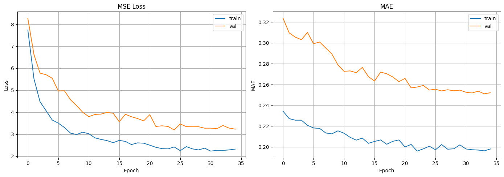

# ML-модель для улучшения изображений

## Общее описание

**ML Image Upgrader** — это веб-приложение для автоматического улучшения качества цифровых изображений по трём параметрам: яркость, контрастность и цветность (насыщенность). В основе системы лежит свёрточная нейросеть, работающая непосредственно в браузере пользователя с помощью TensorFlow.js. Тяжёлая пиксельная обработка выполняется в Web Worker.

Приложение полностью работает на стороне клиента, без серверной части. Загрузка изображений, предсказание параметров, применение коррекции и скачивание результата выполняются локально в браузере. Модель и вспомогательные файлы раздаются статически через GitHub Pages.

Приложение доступно по ссылке: https://mikhailpisemsky.github.io/ML_image_upgrader/

## Компоненты системы

|          Компонент          |                                                     Роль                                                     |
|-----------------------------|--------------------------------------------------------------------------------------------------------------|
|   **Клиент** (Vite + JS)    |          Загрузка модели, предсказание параметров, отображение прогресса, загрузка/скачивание файлов.        |
|       **Web Worker**        |            Выполнение пиксельной обработки в фоновом потоке, периодическое обновление прогресса.             |
|  **Модель** (TensorFlow.js) | Свёрточная нейронная сеть, обученная на синтетических данных, предсказывает оптимальные параметры коррекции. |

## Структура репозитория

```bash
ML_image_upgrader/
├── .github/
│   └── workflows/
│       └── deploy.yml          # GitHub Actions для деплоя на GitHub Pages
├── public/                     # Статические файлы
│   ├── model/                  # Файлы модели (model.json, *.bin)
│   └── worker.js               # Web Worker
├── src/                        # Исходный код клиента
│   ├── main.js                 # Основная логика приложения
│   └── imageProcessor.js       # Загрузка модели и предсказание параметров
├── index.html                  # Главная страница
├── style.css                   # Глобальные стили
├── package.json                # Необходимые зависимости и скрипты
├── vite.config.js              # Конфигурация Vite (base, сервер, плагины)
└── README.md                   # Документация
```

## Пользовательский интерфейс

* **Кнопка «Загрузить изображение»** открывает всплывающее окно с зоной перетаскивания изображения.
* **Две карточки** для сравнения оригинала и результата (с отображением параметров яркости, контрастности, насыщенности).
* **Индикатор прогресса** (полоса статуса обработки изображения + проценты).
* **Информационное сообщение** (сообщение о статусе работы модели, обработки изображения или об ошибке).
* **Кнопка «Скачать»** появляется после обработки, позволяет сохранить результат.
* **Кнопка «Отменить»** прерывает текущую задачу.
* **По клику на изображении** открывается всплывающее окно с увеличением.

### Основные функции (main.js)

1. **Инициализация** – загрузка модели TensorFlow.js из ./model/model.json
2. **Загрузка изображения** – пользователь выбирает файл через всплывающее окно или перетаскиванием.
3. **Предсказание параметров** - изображение отрисовывается в 224×224, преобразуется в тензор, вызывается модель, возвращаются параметры (яркость, контраст, насыщенность).
4. **Пиксельная обработка в Web Worker** – полноразмерное изображение передаётся в worker вместе с параметрами. Worker обрабатывает строки частями (по 200 строк) и отправляет прогресс обратно в основной поток.
5. **Обновление статуса** – по мере получения прогресса обновляется полоса загрузки и статус.
6. **Завершение** – по окончании обработки worker возвращает готовый ImageData, основной поток отображает результат и активирует кнопку скачивания.
7. **Отмена** – при нажатии «Отменить» worker-у посылается сигнал, задача прерывается.

### Web Worker (worker.js)

1. Получает команду process с imageData, параметрами, размером одной части для обработки (200 строк) и размерами изображения.
2. Выполняет пиксельные преобразования (RGB → HSV → RGB) для каждого пикселя в пределах текущей ячейки.
3. После окончания обработки каждой части отправляет статус прогресса в основной поток.
4. При получении сигнала abort прекращает обработку и отправляет подтверждение окончания.
5. По завершении обработки всех ячеек отправляет imageData в основной поток.

### Управление памятью

* Используется tf.tidy() (в imageProcessor.js) для автоматической очистки тензоров.
* После завершения обработки освобождаются URL-объекты (URL.revokeObjectURL).
* Worker после завершения или отмены терминируется.

## Модель (TensorFlow.js)

Полный код подготовки данных, создания и обучения модели представлен в [Jupyter Notebook](ML_improves_image_quality.ipynb).

* **Обучение** на синтетических данных ([COCO 2017](https://www.kaggle.com/datasets/awsaf49/coco-2017-dataset), 50 000 пар).
* **Функция потерь:** взвешенная MSE (вес яркости × 20).
* **Оптимизатор:** Adam (lr=0.001).
* **Аугментации:** отражение, поворот, масштабирование, добавление шума.

### Архитектура (Python + Keras)

```python
inputs = tf.keras.Input(shape=(224,224,3))
x = layers.Conv2D(64, 3, padding='same', activation='relu')(inputs)
x = layers.MaxPooling2D(2)(x)
x = layers.SeparableConv2D(128, 3, padding='same', activation='relu')(x)
x = layers.MaxPooling2D(2)(x)
x = layers.SeparableConv2D(256, 3, padding='same', activation='relu')(x)
x = layers.MaxPooling2D(2)(x)
x = layers.SeparableConv2D(512, 3, padding='same', activation='relu')(x)
x = layers.GlobalAveragePooling2D()(x)
x = layers.Dense(256, activation='relu', kernel_regularizer=regularizers.l2(0.01))(x)
x = layers.Dropout(0.6)(x)
x = layers.Dense(128, activation='relu', kernel_regularizer=regularizers.l2(0.01))(x)
x = layers.Dropout(0.5)(x)
outputs = layers.Dense(3, activation='linear')(x)
```

**Выход:** три нормализованных значения (яркость, контрастность, насыщенность).



## Установка и запуск

**Необходимое ПО:**

* Node.js
* npm или yarn

1. **Клонирование и установка**
```bash
git clone https://github.com/mikhailpisemsky/ML_image_upgrader.git
```
```bash
cd ML_image_upgrader
```
```bash
npm install
```

2. **Скрипты запуска**

Для разработки:
```bash
npm run dev
```
Для сборки продакшен-версии:
```bash
npm run build
```
Для предпросмотра собранного проекта:
```bash
npm run preview
```
